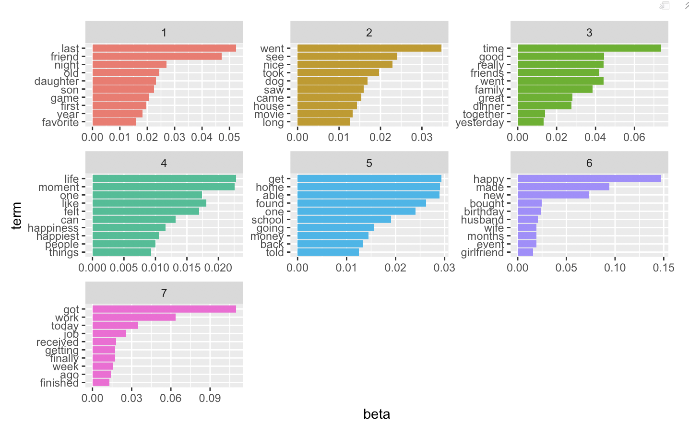

PART ONE: Particular words (key words) Analysis

1.1 Load all the required libraries

```{r load libraries, warning=FALSE, message=FALSE}
library(tidyverse)
library(tidytext)
library(DT)
library(scales)
library(wordcloud2)
library(gridExtra)
library(ngram)
library(shiny) 
library(wordcloud)
library(dplyr)
library(janeaustenr)
library(SnowballC)
library(koRpus)
```

1.2 Load the processed text data along with demographic information on contributors
(Use the processed data for analysis and combine it with the demographic information available.)

```{r load data, warning=FALSE, message=FALSE}
hm_data <- read_csv("../output/processed_moments.csv")

urlfile<-'https://raw.githubusercontent.com/rit-public/HappyDB/master/happydb/data/demographic.csv'
demo_data <- read_csv(urlfile)
```


1.3 Combine processed data sets and demogeraphic information (eg. gender, martial, age), and keep the required columns for analysis. Select a subset of the data that satisfies specific row conditions.

```{r combining data, warning=FALSE, message=FALSE}
hm_data <- hm_data %>%
  inner_join(demo_data, by = "wid") %>%
  select(wid,
         original_hm,
         gender, 
         marital, 
         parenthood,
         reflection_period,
         age, 
         country, 
         ground_truth_category, 
         text) %>%
  mutate(count = sapply(hm_data$text, wordcount)) %>%
  filter(gender %in% c("m", "f")) %>%
  filter(marital %in% c("single", "married")) %>%
  filter(parenthood %in% c("n", "y")) %>%
  filter(reflection_period %in% c("24h", "3m")) %>%
  mutate(reflection_period = fct_recode(reflection_period, 
                                        months_3 = "3m", hours_24 = "24h"))
```

```{r}
datatable(hm_data)
```

1.4 Create a bag of words using the processed text data. Show frequency of key words.

```{r bag of words, warning=FALSE, message=FALSE}
bag_of_words <-  hm_data %>%
  unnest_tokens(word, text)

word_count <- bag_of_words %>%
  count(word, sort = TRUE)
```

```{r warning=FALSE}
wordcloud(word_count$word, word_count$n, max.words=100, colors = brewer.pal(9,"BuGn"))
```

From the wordcloud plot above, the words "friend", "day" and "time" are quite frequent words. But we might consider words such as "day" and time" are nonsense for happy moments. Then we have to make deeper analysis. 

1.5 Create bigrams using the text data

```{r bigram, warning=FALSE, message=FALSE}
library(igraph)
library(ggraph)
hm_bigrams <- hm_data %>%
  filter(count != 1) %>%
  unnest_tokens(bigram, text, token = "ngrams", n = 2)

bigram_counts <- hm_bigrams %>%
  separate(bigram, c("word1", "word2"), sep = " ") %>%
  count(word1, word2, sort = TRUE)

bigram_graph <- bigram_counts %>%
  filter(n > 200) %>%
  graph_from_data_frame()


set.seed(123)
    
x <- grid::arrow(type = "closed", length = unit(.1, "inches"))
    
ggraph(bigram_graph, layout = "fr") +
  geom_edge_link(aes(edge_alpha = n), show.legend = FALSE,
                     arrow = x, end_cap = circle(.05, 'inches')) +
  geom_node_point(color = "orange", size = 3) +
  geom_node_text(aes(label = name), repel = TRUE) +
  theme_void()
```

From the arrow pointing above, we notice word "friend" is the most frequent word, and "birthday" is also very frequent.

1.6 Text processing: remove extra white space, convert all letters to the lower case, remove stop words, remove empty words due to formatting errors, and remove punctuation. Then we compute the Document-Term Matrix (DTM).

```{r warning=FALSE, message=FALSE}
library(textstem)

bag_of_words$word=lemmatize_words(bag_of_words$word)
word_count_lemm <- bag_of_words %>%
  count(word, sort = TRUE)
	
library(tm)
	
hm_corpus <- VCorpus(VectorSource(hm_data$original_hm))

#remove potentially problematic symbols
hm_corpus <- tm_map(hm_corpus, content_transformer(tolower))

#Strip digits
hm_corpus <- tm_map(hm_corpus, removeNumbers)

#remove punctuation
hm_corpus <- tm_map(hm_corpus, removePunctuation)

#remove stopwords
hm_corpus <- tm_map(hm_corpus, removeWords, c("the", "and",'day', stopwords("english")))

#remove whitespace
hm_corpus =  tm_map(hm_corpus, stripWhitespace)
	  
#compute TF-IDF weighted document-term matrices and remove sparse terms
hm_tfidf <- DocumentTermMatrix(hm_corpus, control = list(weighting = weightTfIdf))
hm_tfidf <- removeSparseTerms(hm_tfidf, 0.99)
	
freq = data.frame(sort(colSums(as.matrix(hm_tfidf)), decreasing=TRUE))
df=data.frame(lemm_words=lemmatize_words(rownames(freq)),score=freq[,1])
df_new=df[!duplicated(df$lemm_words), ]

wordcloud(df_new$lemm_words, df_new$score, max.words=100, random.order = F, colors=brewer.pal(8,"Blues"))
```	

After doing text processing above, we get better results for those happy moments key words. Words such as "work", "family" and "dinner" become frequent words as well.

PART TWO: Demographic Analysis (gender, age)

2.1 Counts for each predicated categories (7 in total)

```{r}
data <- hm_data[!is.na(hm_data$ground_truth_category), ]
ggplot(data, aes(x = data$ground_truth_category, y = data$count)) +
  geom_bar(stat="identity", fill = "lightgreen") +
  xlab("Predicted Categories") +
  ylab("Count")
```

For 7 predicted categories, "affection" has higest frequency, and "exercise" has lowest frequency.

2.2 Counts for each "Gender" and "Marital" status graph

```{r}
var_count <- bag_of_words %>%
  count(wid, word, gender, marital, parenthood, reflection_period, country, sort = TRUE)

hm_gender_marital <- var_count %>%
  bind_tf_idf(word, wid, n)
	
hm_gender_marital <- hm_gender_marital[nchar(hm_gender_marital$word)>3,]
	
hm_gender_marital %>% 
  group_by(gender) %>% 
  top_n(10, tf_idf) %>% 
  ungroup() %>%
  mutate(word = reorder(word, tf_idf)) %>%
  ggplot(aes(word, tf_idf, fill = marital)) +
  geom_col(show.legend = TRUE, xlim = c(0,3)) +
  labs(x = NULL, y = "tf-idf") +
  facet_wrap(~gender, ncol = 2, scales = "free") +
  coord_flip()
```

For the above plots, we discover that married Female tends to use tablet, and single male likes to take motocycle which are interesing.

2.3 Age vs. Sentiment plot

```{r message = FALSE}
teens_age <-  hm_data %>%
  filter(age >=15 & age<24) %>%
  unnest_tokens(word, text)
	
young_age <- hm_data %>%
  filter(age >=25 & age<34) %>%
  unnest_tokens(word, text)

adults_age <- hm_data %>%
  filter(age >=35 & age<64) %>%
  unnest_tokens(word, text)
	
senior_age <- hm_data %>%
  filter(age >65) %>%
  unnest_tokens(word, text)
	
age_stage <- bind_rows(teens_age %>%
                         inner_join(get_sentiments("bing")) %>%
                         count(word, sentiment) %>%
                         spread(sentiment, n, fill = 0) %>%
                         mutate(sentiment = positive - negative,method="teens_age"), young_age %>%
                         inner_join(get_sentiments("bing")) %>%
                         count(word, sentiment) %>%
                         spread(sentiment, n, fill = 0) %>%
                         mutate(sentiment = positive - negative,method="young_age"), adults_age %>%
                         inner_join(get_sentiments("bing")) %>%
                         count(word, sentiment) %>%
                         spread(sentiment, n, fill = 0) %>%
                         mutate(sentiment = positive - negative,method="adults_age"),senior_age %>%
                         inner_join(get_sentiments("bing")) %>%
                         count(word, sentiment) %>%
                         spread(sentiment, n, fill = 0) %>%
                         mutate(sentiment = positive - negative,method="senior_age"))
```


```{r}
ggplot(age_stage, aes(x = method, y = sentiment, color = method)) + 
  geom_boxplot()+
  coord_flip()
```

From the boxplots above, senior age tends to have little emotional fluctuation (less positive or negative sentiment); however, teens age has more fluctuating emotions (both positive and negative), and teens are easier to be happy.


PART THREE: Sentiment Analysis

```{r warning=FALSE, message=FALSE}
library(reshape2)
bag_of_words %>%
  inner_join(get_sentiments("bing")) %>%
  count(word, sentiment, sort = TRUE) %>%
  acast(word ~ sentiment, value.var = "n", fill = 0) %>%
  comparison.cloud(colors = c("blue", "orange"), max.words = 100)
```

From this comparison cloud, number of positive emotions are more than number of negative emotions which means people tend to possess postive attitude.


PART FOUR: Topic Modeling (generate document-term matrices and run LDA)


```{r}
library(topicmodels)

dtm <- DocumentTermMatrix(hm_corpus, control = list(bounds = list(global = c(5, Inf))))
rowTotals <- apply(dtm , 1, sum)
dtm <- dtm[rowTotals> 0, ]

lda_topic <- LDA(dtm, k = 7, method = "Gibbs", control = list(iter = 300))
                 
text_topics <- tidy(lda_topic, matrix = "beta")
	
text_top_terms <- text_topics %>%
  group_by(topic) %>%
  top_n(10, beta) %>%
  ungroup() %>%
  arrange(topic, -beta)
	
# text_top_terms %>%
#   mutate(term = reorder(term, beta)) %>%
#   ggplot(aes(term, beta, fill = factor(topic))) +
#   geom_col(show.legend = FALSE) +
#   facet_wrap(~ topic, scales = "free") +
#   coord_flip()

```



For topic analysis, I chose 7 topics here. It is clear to see top 10 terms in each topics. For example, term "friend" has highest percentage in topic 4.


####-end